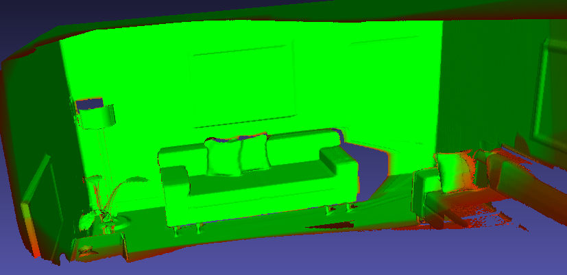
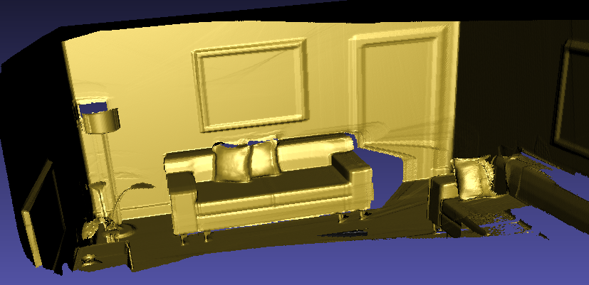

# Description

**This is still under development and needs improvements in many ways**

This repository contains the code to perform a basic 3D resconstruction from a set of depth maps on
GPU, it is built on Linux using CUDA.

# Usage
## Datasets

Currently, since no registration is used at all, 3D reconstruction will only work for well aligned
3D frames. In practical, it has only been tested on synthetic datasets.

For the tests currently, I use the ICL-NUIM dataset : 
https://www.doc.ic.ac.uk/~ahanda/VaFRIC/iclnuim.html

I added a few scripts to get them and format them so they can be used by this algorithm. To get 
them, in the project root folder, just make a call to `bash scripts/get-datasets.sh`.

In theory (but hasn't been tested yet), it should work with custom datasets as long as the follow
these rules :
 - depth and rgb images have the same size
 - depth is in format u16
 - rgb is in format u8
 - 6 dof poses are in txt format in the form : tx, ty, tz, qx, qy, qz, qw
 - depth, rgb and pose info are in the same directory and are named depth_k.png, color_k.png, 
pose_k.txt,, where k is the number of the current frame
 - the dataset folder must also contain an intrinsics.txt describing the camera intrinsics 
 (pinhole camera model only).

## Build

The project is in c++17 using CUDA 11 or above, the target architecture was for my GPU (RTX 2070).
Feel free to add other target architectures in the Makefile if needed.
I try to keep it as simple as possible anyway, one would need the following dependnecies to build
the project :
- opencv4
- gflags
- cuda-11.x
- tinyply : https://github.com/ddiakopoulos/tinyply
- openmp (integrated with g++)

On a Linux machine configured with the above dependencies, a call to `make` should be enough to 
build everything.

By changing the value of the `LOG_LEVEL` macro in the Makefile, we can make the program more or less
verbose (`-DLOG_LEVEL=0` for full verbosity).

## Run the reconstruction

Be sure to have a working dataset, then run :
`./output/bin/main --dataset <path-to-dataset>`

This will run the reconstruction algorithm with default parameters and export the final 
reconstruction result in `output.ply`.

THis may take a while to load all the data in memory, then the 3D reconstruction will start.

Here is the llist of parameters to be set :
- `--dataset` : dataset path
- `--frameCount` : max number of frames to process, set to `0` to process all the frames
    (default set to `0`)
- `--maxDepth` : max depth value (in meter) used to integrate a frame. This can be used to 
    filter out far depth values whose can produce too inaccurate results (default set to `10`).
- `--tau` : truncation distance (in meter) for the 3D reconstruction. It will affect the 
    amount of CPU and GPU memory used. A good value for tau is that it is at least in the order of
    magnitude of the depth incertitude (default set to `0.1`).
- `--voxelRes` : spatial resolution for the reconstruction. In general, it doesn't make sense to 
    make it smaller than the scanner resolution, it can have a huge impact on performance and memory 
    used (default set to `0.01`).

# Things to do

- **MAJOR** Generate basic geometric primitives for testings
- **MAJOR** Debug the raycaster
- **MAJOR** Get rid of the `std::unordered_map` and find a more suitable and performant data 
structure for voxel blocks
- Improve data loading or at default interleave loading and reconstruction
- Add colors and gradients
- Add multiple levels
- Implement a basic point cloud registration (test projective and tsdf icp)
- Implement Marching Cubes on GPU

# References

Newcombe, R. A., Izadi, S., Hilliges, O., Molyneaux, D., Kim, D., Davison, A. J., ... & Fitzgibbon, A. (2011, October). Kinectfusion: Real-time dense surface mapping and tracking. In 2011 10th IEEE international symposium on mixed and augmented reality (pp. 127-136). Ieee.

Klingensmith, M., Dryanovski, I., Srinivasa, S. S., & Xiao, J. (2015, July). Chisel: Real Time Large Scale 3D Reconstruction Onboard a Mobile Device using Spatially Hashed Signed Distance Fields. In Robotics: science and systems (Vol. 4, No. 1).

Lorensen, W. E., & Cline, H. E. (1998). Marching cubes: A high resolution 3D surface construction algorithm. In Seminal graphics: pioneering efforts that shaped the field (pp. 347-353).

Handa, A., Whelan, T., McDonald, J., & Davison, A. J. (2014, May). A benchmark for RGB-D visual odometry, 3D reconstruction and SLAM. In 2014 IEEE international conference on Robotics and automation (ICRA) (pp. 1524-1531). IEEE.